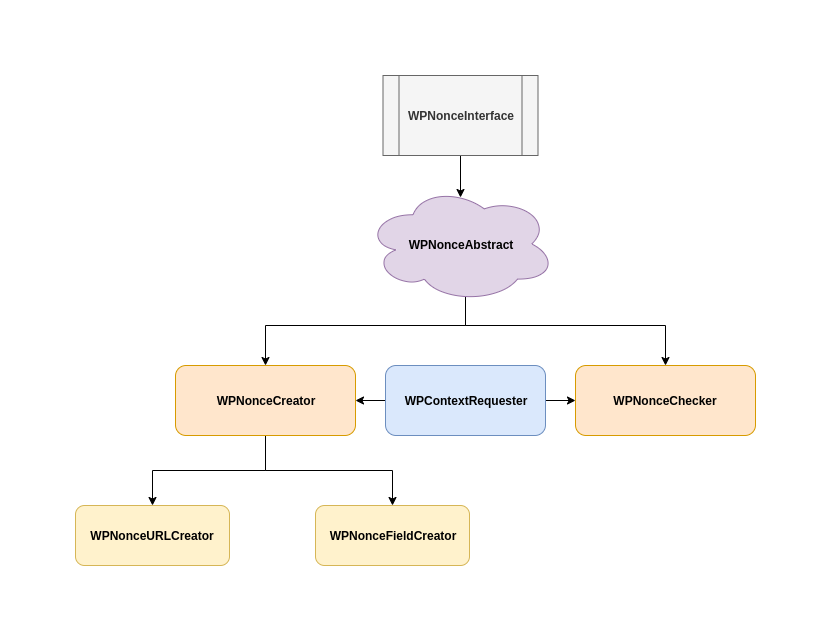

# Changelog

## 0.0.2 (2019-12-23)

**Fixed bugs:**

 1. Inheritance: Fixed the "decoupling" problem between the `WPNonceChecker` (nonce validation class) and its parent class `WPNonce` (main nonce class definition).

 2. In the previous version, all the Nonce creation logic was centralized in the `WPNonce` class, which made the structure very rigid and was lacking modularity.

 3. The interface structure needed to be redefined to better reflect the new classes.

**Implemented enhancements:**

1. Instead of building a parent/child relationship between these two classes (`WPNonce` and `WPNonceChecker`), a better solution was to implement a "top-level" abstract class called `WPNonceAbstract` with the main Nonce definition. This abstract class will be implemented by any of the classes which may need a basic Nonce definition to properly work.

2. The solution was to implement a separate class for each different context: `WPNonceDefaultCreator`, `WPNonceURLCreator` and `WPNonceFieldCreator`.

3. A new interface definition was placed on top of `WPNonceAbstract` to comply with the structural requirements for a basic Nonce implementation.

| Class                 | Interface               |
|:---------------------:|:-----------------------:|
| WPNonceAbstract       | WPNonceInterface        |

**Architechture overview**

Here you can find a summary of the structure mentioned above:

